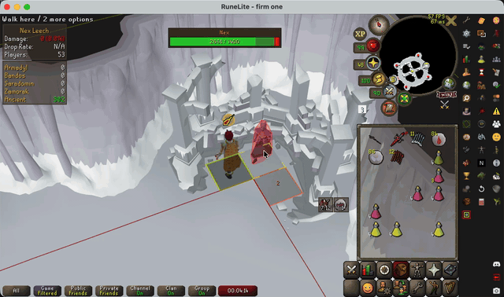
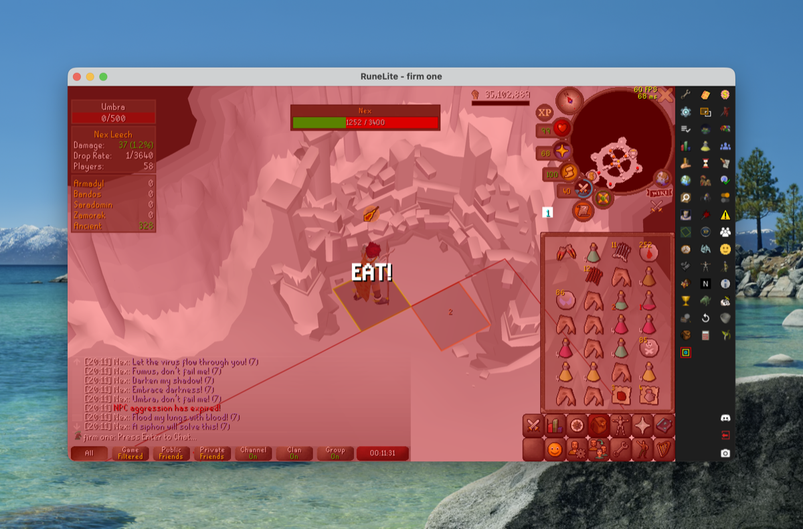
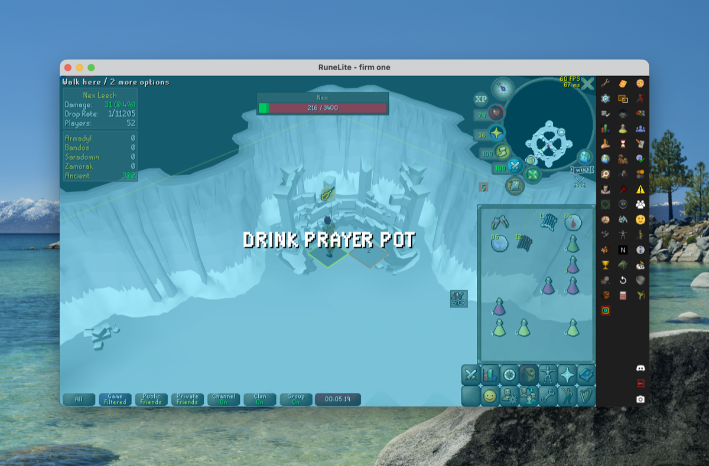

# Nex Leech Utility

A RuneLite plugin that helps you efficiently leech loot from Nex by hitting the
minimum **25 damage** with the least effort, while staying safe.

## Features

- **Per-kill damage tracker** — an overlay showing your own damage and
  contribution this kill (e.g. `25 (0.5%)`), turning **green once you reach 25**
  (the loot-eligibility threshold), red until then. Also shows your **drop rate**
  (1/N from contribution) and the **player count**, and stays visible after the
  kill so you can read the result.
- **Minion vulnerability highlighting** — Fumus, Umbra, Cruor and Glacies are
  outlined: faint **red** while invulnerable, hard **green** the instant they
  become attackable (driven by Nex's `"<minion>, don't fail me!"` callouts),
  resetting when the kill ends. Colours are configurable.
- **Starting minion + leech-rotation warnings** — pick the **minion you start
  on** (e.g. Umbra to skip Fumus). A prominent centred warning announces when
  that minion — or any later one, if you still need damage — is about to become
  vulnerable, with a **countdown**, then switches to "ATTACK NOW" when it's live.
  Warnings stop automatically once you've reached 25 damage.
- **Focus grab** — optionally bring the client window to the front when the
  warning fires (so you don't miss the hit while tabbed out) and/or when the kill
  ends and loot drops (so you can grab it). Request or force focus.
- **De-prioritized minion attack** — removes left-click *Attack* on a minion
  while it's invulnerable (so you can't misclick it); left-click *Attack* returns
  the moment it becomes attackable.
- **Optional blood-reaver highlighting** — reavers also count towards your damage.
- **Low HP / prayer alert** — optionally flash the screen with a configurable
  message (e.g. `EAT!` / `DRINK PRAYER POT`) when HP or prayer drop below
  configurable thresholds (default 60 HP / 50 prayer). Stays up until the stat
  recovers, or for a set number of seconds.
- **Hide players / thralls** — entity-hider style; hide other players and/or
  reanimated thralls while inside the Nex room to cut clutter (your own character
  is kept).

## Demo



## Screenshots

| Low HP alert | Low prayer alert |
| --- | --- |
|  |  |

## Credits

- Nex fight detection and per-kill damage tracking adapted from the
  [Nex Droprate Calculator](https://github.com/Worley03/nex-droprate-calculator)
  plugin (© Smug Pepe, BSD 2-Clause).
- Nex chat-line and NPC-id conventions from the community "Nex Extended" plugin
  (BSD 2-Clause).

## Building

Requires JDK 11.

```
./gradlew build
```
